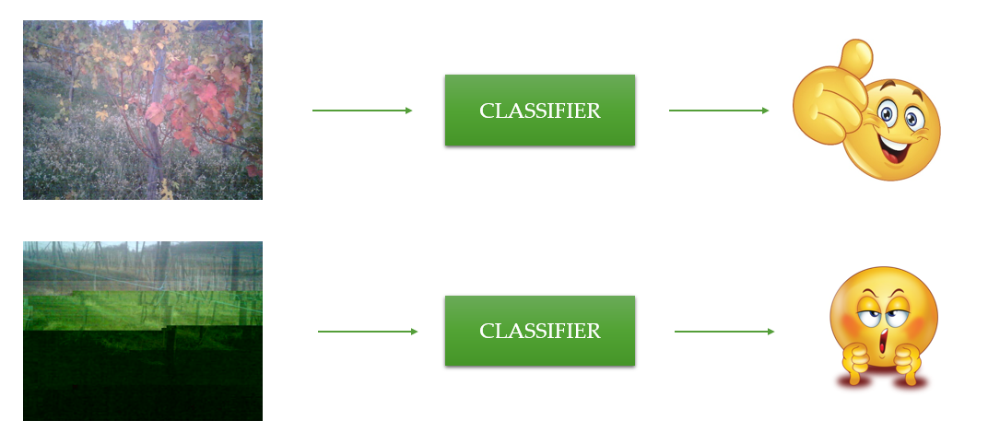

# IWProject
Innovative Wireless Project - Group 3 - __Piero Cavalcanti, Giuseppe Giametta, Marco Bergesio__

Topic: Simple Image classifier that can discriminate right photos from corrupted or black images. Based on Naive bayes or SVM implementation. 

See Slides in repo for further details.

